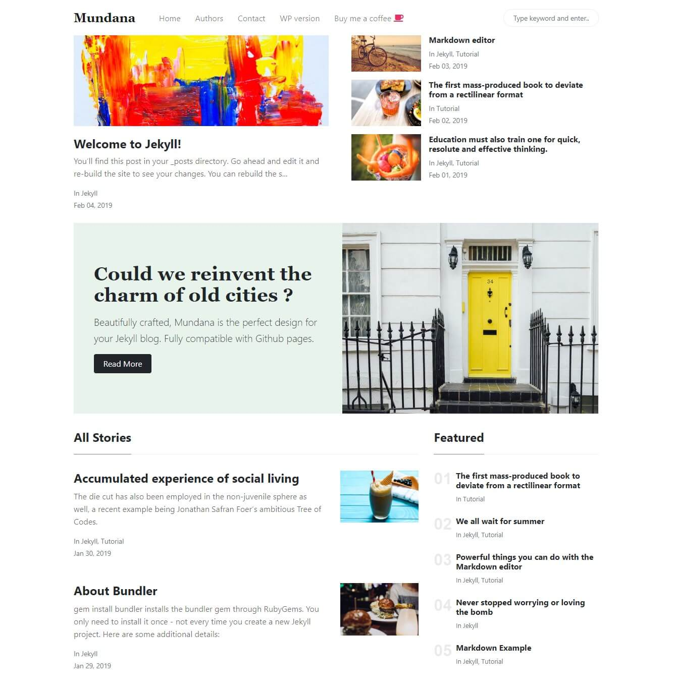
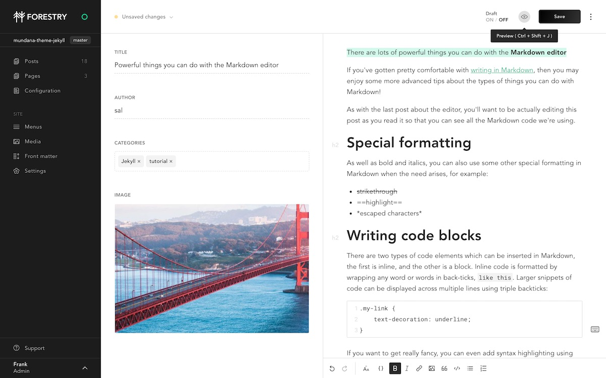

# Jekyll Mundana Forestry starter

Theme designed and developed by [wowthemes](https://github.com/wowthemesnet/mundana-theme-jekyll),



[Live Preview](https://wowthemesnet.github.io/mundana-theme-jekyll/)

## Requirements

- Ruby > 2.5
- Jekyll ~> 3.8

## Content Management

[](https://app.forestry.io/quick-start?repo=forestryio/jekyll-mundana-forestry&engine=jekyll)



This project is pre-configured for [Forestry](https://forestry.io) a Git-based CMS, [import it](https://app.forestry.io/quick-start?repo=forestryio/jekyll-mundana-forestry&engine=jekyll) to edit and preview your site ✨.

Any changes you make in Forestry is commited back to the repository and automatically deployed.

## Local development

```bash
# clone your imported repository
# cd in the project directory
# install dependencies
bundle
# Start local dev server
bundle exec jekyll serve --livereload --drafts
```

## Deployment and hosting

### GitHub Pages

Go to your repository settings and activate GitHub Pages in the root folder.

### Vercel

[](https://vercel.com/import/git)

Copy-paste your Git repository URL, accept default settings and click deploy ✨.

### Netlify

[](https://app.netlify.com/start/deploy?repository=https://github.com/forestryio/jekyll-mundana-forestry)

1. Set the build command to: `jekyll build`
2. Set the publish directory to: `site`

That's it, now your site gets deployed automatically on `git push` or when saving documents from Forestry.

## Feedback

[Open an issue](https://github.com/wowthemesnet/mundana-theme-jekyll/issues) in the theme's repository.

## LICENSE

[MIT](LICENSE)
